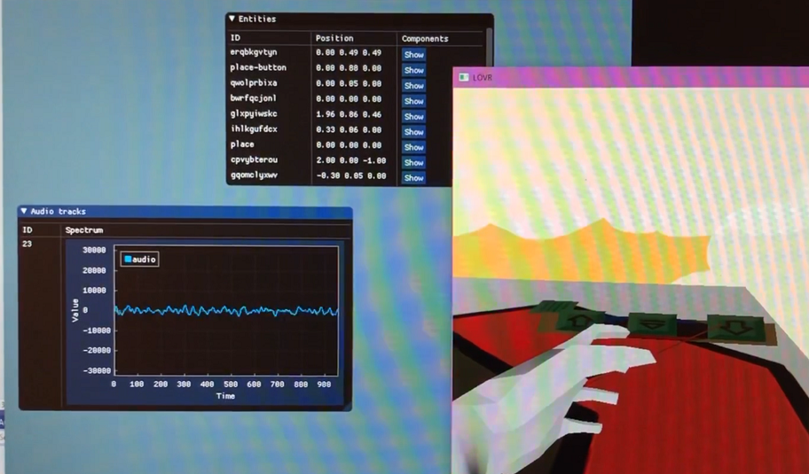

# Alloverse Place Inspector

The Inspector is a desktop application that connects to an 
[Alloverse place](https://alloverse.com) in order to debug the place itself,
or any apps running inside it.

While this app is technically an Alloverse VR application since it connects
to the place as an alloapp, its only UI is the desktop UI you see when
you launch it in 2D.

## Windows

Running from IDE:

1. Using Visual Studio 2019, "open local folder" for this repo
2. In the Solution Explorer, right-click the `alloinspector` target and choose "Add Debug Configuration"
3. Add this line to the default configuration: `"currentDir": "${workspaceRoot}"`
4. Run the target and connect to the place you want to debug.
